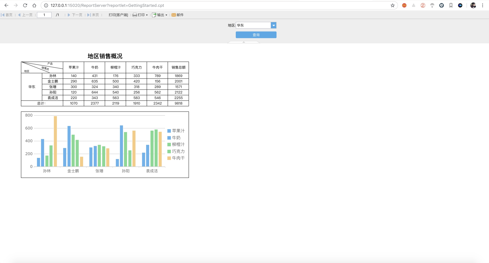

# fine-report

> 帆软报表9.0，基于spring boot。

## 安装依赖

由于帆软只给了`jar`包，我们需要通过`maven`安装到本地仓库。

### Windows

对于`Windows`用户，运行`install/installjars.bat`。

### Unix

对于`Linux`、`Mac os`用户，运行`install/installjars.sh`。

## 配置

### 系统

#### 端口

默认15020。配置文件`src/main/resources/application.yml`。

#### 日志

日志默认（异步）输出到`logs`目录下，配置文件`src/main/resources/logback-spring.xml`。

默认日志级别`INFO`，文件格式`finereport.yyyy-MM-dd.log`

### 帆软

#### 数据集

一般需要配置服务器数据集，修改配置文件`env/WEB-INF/resources/datasource.xml`

#### 数据库

如果需要使用`保存常用参数`等功能，则需要使用数据库。（默认不启用）

修改配置文件`env/WEB-INF/resources/config.xml`。

#### 日志

日志默认输出到`logs`目录下，配置文件`env/WEB-INF/resources/log4j.properties`。（默认日志级别`INFO`）

#### CPT模板

需要将cpt上传到`env/WEB-INF/reportlets`下。

#### FRDemo.db

可以通过`env/FRDemo.db`这个sqlite数据库，进行本地测试。

## 部署

### 打包

```shell
$ mvn clean
$ mvn package
```

### 运行

注意：**需要将`env`目录与打包好的`jar`放在同一个目录下**，程序启动后会将`env`目录作为`docBase`。

```shell
$ nohup java -jar hdsp-finereport.{version}.jar > startup.log &
```

### 访问

* 浏览器访问：`http://127.0.0.1:15020`
* 帆软地址：`http://127.0.0.1:15020/ReportServer`。
* 访问帆软模板：`http://127.0.0.1:15020/ReportServer?reportlet=GettingStarted.cpt`，其中`GettingStarted.cpt`需要在`env/WEB-INF/reportlets`下存在。



## 问题

### 为什么要重置`src/main/webapp`目录到`env`？

这是因为创建`src/main/webapp`目录后，如果将帆软资源复制进去后，那么在打包的时候，则需要打成`war`包（通过`tomcat`部署）。

而重置`webapp`目录到`env`后，可以打包成`jar`包，帆软此时通过`env`目录来进行配置读取、模版解析、备份等。

也就是说，`env`目录相当于`tomcat`的`docBase`了。